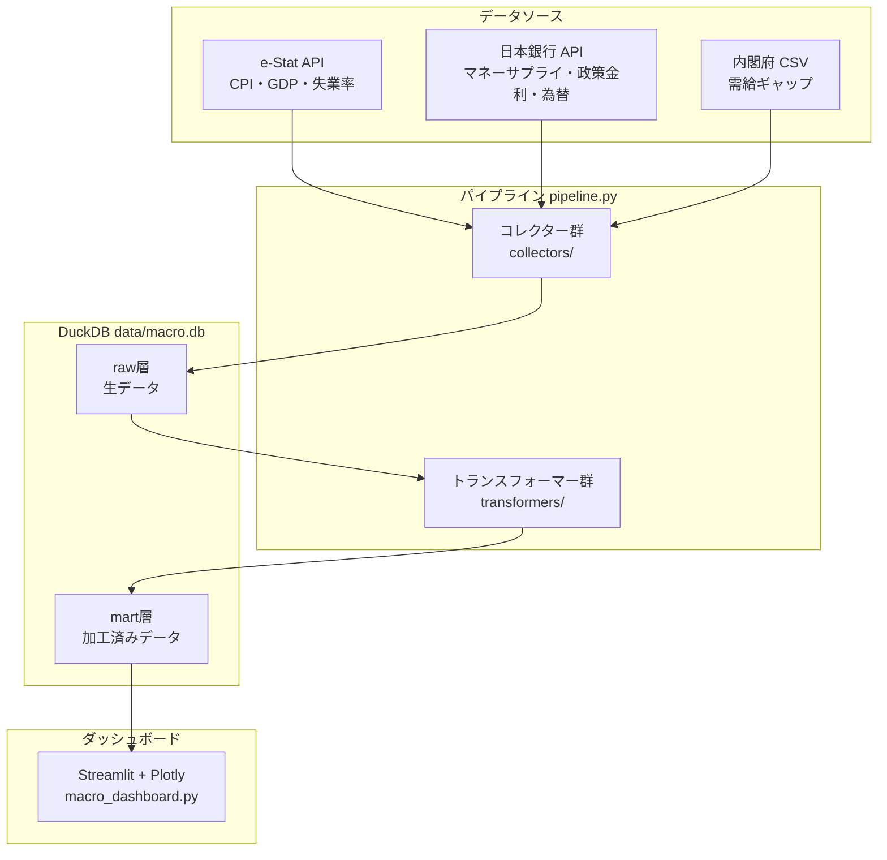
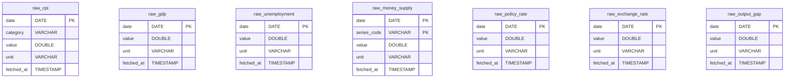
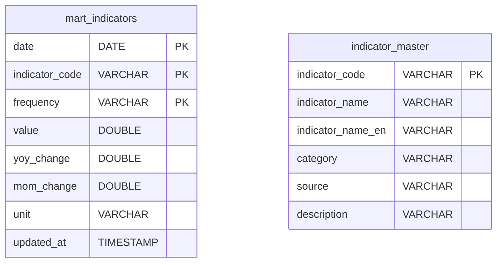
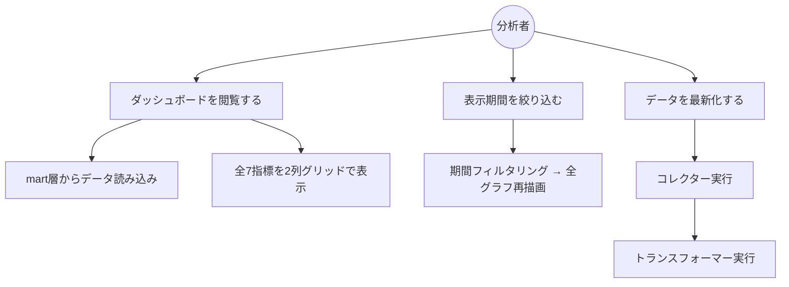

# 機能設計書

## システム構成図



---

## コンポーネント設計

### 1. コレクター（`collectors/`）

データソースごとに1ファイルで実装する。共通インターフェースを持ち、`pipeline.py` から呼び出される。

| ファイル | 対象指標 | データソース |
|---------|---------|------------|
| `estat_collector.py` | CPI・GDP・失業率 | e-Stat API |
| `boj_collector.py` | マネーサプライ・政策金利・為替 | 日本銀行 時系列統計 API |
| `cao_collector.py` | 需給ギャップ | 内閣府 ファイルダウンロード（CSV or Excel） |

**共通インターフェース:**

```python
class BaseCollector:
    def fetch(self) -> pd.DataFrame:
        """生データを取得してDataFrameで返す"""
        ...

    def save_raw(self, df: pd.DataFrame) -> None:
        """DuckDB の raw 層に差分保存する"""
        ...
```

### 2. トランスフォーマー（`transformers/`）

raw 層のデータを mart 層に変換する。

| ファイル | 処理内容 |
|---------|---------|
| `base_transformer.py` | 共通変換処理（型変換・欠損補完） |
| `aggregator.py` | 月次・四半期・年次への集計 |
| `calculator.py` | 前年同月比・前期比の計算 |

### 3. パイプライン（`pipeline.py`）

全コレクターと全トランスフォーマーを順次実行するエントリーポイント。

```
python pipeline.py
  ↓
1. 各コレクターで生データ取得 → raw 層に保存
2. 各トランスフォーマーで加工 → mart 層に保存
3. 実行ログを出力
```

### 4. ダッシュボード（`macro_dashboard.py`）

Streamlit で実装するインタラクティブ画面。mart 層のデータを読み込み、Plotly グラフで表示する。

---

## データモデル定義

### raw 層（生データ）

各指標ごとにテーブルを持つ。取得したデータをそのまま保存する。



### mart 層（加工済みデータ）

分析・表示用に整形した統合テーブル。



**`indicator_code` 一覧:**

| コード | 指標名 | 頻度 |
|-------|-------|------|
| `CPI` | 消費者物価指数 | 月次 |
| `GDP` | 国内総生産 | 四半期 |
| `UNEMPLOYMENT` | 完全失業率 | 月次 |
| `M2` | マネーサプライ（M2） | 月次 |
| `POLICY_RATE` | 政策金利 | 月次 |
| `USDJPY` | 円ドル為替レート | 月次 |
| `OUTPUT_GAP` | 需給ギャップ | 四半期 |

---

## 画面設計

### ダッシュボード画面（メイン）

全7指標を1画面に表示するグリッド（2列）レイアウト。
期間スライダーはヘッダーに1つ配置し、全グラフに共通適用する。
需給ギャップはゼロラインを持つ特性から全幅で表示する。

将来的に他国との比較を行う場合、ヘッダーに国選択UIを追加し、各グラフに国別折れ線を重ねる方式で対応する。
その際、国ごとに単位・基準が異なる指標は transformer 側で正規化（前年同月比への統一など）して対応する。

```
┌─────────────────────────────────────────────────────────────┐
│  日本マクロ経済ダッシュボード          最終更新: 2025-01-01  │
│  期間: [1990] ──────────●────────────────────── [2025]      │
├──────────────────────────────┬──────────────────────────────┤
│  CPI（消費者物価指数）         │  GDP（国内総生産）            │
│  ～～／～～                   │  ／～～～                    │
├──────────────────────────────┼──────────────────────────────┤
│  失業率                       │  マネーサプライ（M2）          │
│  ～＼～～                     │  ／／～～                    │
├──────────────────────────────┼──────────────────────────────┤
│  政策金利                     │  為替（USD/JPY）              │
│  ─────                       │  ～～＼～                    │
├──────────────────────────────┴──────────────────────────────┤
│  需給ギャップ（全幅）                                         │
│  ～～── 0 ──────────────────────────────────────────────    │
└─────────────────────────────────────────────────────────────┘
```

### UI コンポーネント一覧

| コンポーネント | 種別 | 説明 |
|-------------|------|------|
| 期間スライダー | レンジスライダー | 表示期間の開始・終了年を指定（全グラフ共通） |
| 時系列グラフ × 6 | 折れ線グラフ | CPI・GDP・失業率・M2・政策金利・為替を2列グリッドで表示 |
| 需給ギャップグラフ | 折れ線グラフ（全幅） | 0ラインを強調表示 |
| 最終更新日時 | テキスト | データの鮮度を表示 |

---

## ユースケース図



---

## データフロー詳細

### データ取得フロー（差分更新）

```
1. raw テーブルの最終日付を取得
2. 最終日付の翌日以降のデータをAPIから取得
3. 取得データを raw テーブルに追記
4. raw → mart への変換・集計を再実行
```

### ダッシュボード表示フロー

```
1. streamlit run macro_dashboard.py で起動
2. mart_indicators から全指標データを読み込み
3. 全7指標を2列グリッドで初期表示
4. 期間スライダー変更 → ページ再実行 → 全グラフ再描画
```
